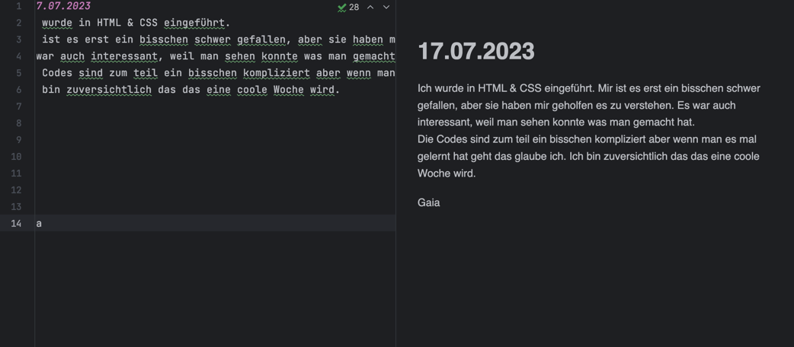

### 17.07.2023

Ich wurde in HTML & CSS eingeführt.
Mir ist es erst ein bisschen schwer gefallen, aber sie haben mir geholfen es zu verstehen.
Es war auch interessant, weil man sehen konnte was man gemacht hat.  
Die Codes sind zum teil ein bisschen kompliziert aber wenn man es mal gelernt hat geht das glaube ich.
Ich bin zuversichtlich das das eine coole Woche wird.

Gaia

## 18.07.2023:
Wir haben heute die MySQL angeschaut. 
Mir gefiel es sehr aber es war zum teil sehr kompliziert.
Aber mit hilfe von Cyrill und Mario gings.
Ich bin gespannt wie es Morgen wird...
Es macht mich immer wieder stolz zu sehen was man gemacht hat.

### Gaia

## 19.07.2023:
Zuerst haben wir schritt für schritt Javascript angeschaut.
Als ich es mehr oder weniger verstanden habe, ging es darum so viel wie möglich alleine zu machen.
Das ging einergermassen gut. Ich bin gespannt wie viel ich heute alleine schaffen soll...:)

### Gaia

## 20.07.2023:
Heute kam Carsten zu mir mit einer "tollen" überraschung:
Ich soll eine Präsi halten.
Zuerst bekam ich ein bisschen panik aber danach hies es ich soll einfach erzählen was ich diese woche gemacht habe.
Ich hoffe ich bin nicht allzu nervös bei der Besprechung.
Das wird schon denke ich.

